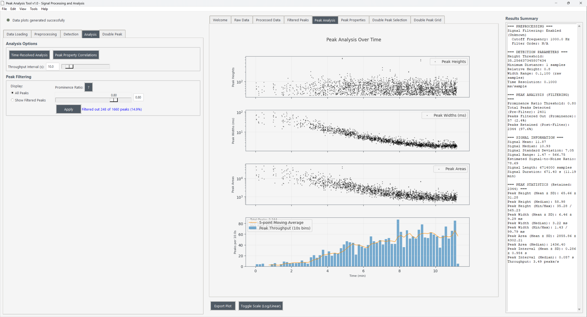

# Peak Analysis Tool


High-precision, browser-based analysis for time-series peaks. The tool loads raw detector traces, applies noise filtering (including photon-counter dead-time correction), detects peaks with fine-grained controls, and gives you fast visual feedback plus export-ready results.



## What This App Does

- Load individual or batched `.txt`, `.xls`, `.xlsx` files with optional experiment protocol metadata.
- Apply preprocessing: Butterworth or Savitzky-Golay filters, custom time resolution, and dead-time correction for photon counters.
- Detect peaks with configurable prominence, width, spacing, and automatic threshold suggestions.
- Run double-peak analysis to quantify paired events (distance, prominence ratio, width ratio).
- Explore interactive charts (uPlot-based) with synchronized previews of raw and filtered signals.
- Export peaks, metadata, and protocol details to CSV/Excel and download high-resolution chart images.
- Ship as a local web app: a single Windows executable or a Python + Next.js setup for development.

## Why It Is Great

- Fast front end: uPlot with an isolated data worker keeps interactions smooth even on million-point traces.
- Accurate processing: all analysis runs on full-resolution arrays; previews are decimated only for rendering.
- Progress you can trust: long-running jobs stream updates over WebSockets so you know where you are.
- Reproducible context: protocol metadata and corrections stay attached to your datasets and exports.
- Ready to share: static Next.js export can be bundled with the FastAPI backend for one-click distribution.

## How the Workflow Fits Together

1. **Load**: Select one or many files (or enter absolute paths) and capture protocol metadata and time resolution. Enable dead-time correction for photon counters.
2. **Preprocess**: Choose filter type and parameters; preview raw vs. filtered traces.
3. **Detect**: Tune prominence, width, distance, relative height, and optional auto-thresholding; review detected peaks.
4. **Analyze**: Inspect time-series overlays, throughput, and histograms; zoom into regions of interest.
5. **Double Peaks**: Pair events by proximity and measure intensity/shape relationships.
6. **Export**: Save tables (CSV/Excel/Text) and download publication-ready PNGs directly from the charts.

## Architecture at a Glance

- **Backend**: FastAPI (`service/app.py`) with WebSocket progress streaming and binary-friendly endpoints for data/preview delivery.
- **Frontend**: Next.js + TypeScript UI (`ui-web/`) using uPlot for high-density plots and a dedicated worker to manage typed-array buffers.
- **Packaging**: Static Next.js export lives in `ui-web/out/` and is served by the backend; Windows builds ship as `PeakService.exe`.
- **Core analysis**: Signal processing, dead-time correction, and peak/double-peak routines are implemented in `core/`.

## Installation and Running

### Fast Start (Windows Executable)
1. Download `PeakService.exe` from the release.
2. Double-click it. The backend starts on `http://127.0.0.1:8765` and opens your default browser.

### Run from Source (recommended: `uv`)
```bash
# 1) Create and activate a virtual env
uv venv
.\.venv\Scripts\activate  # Windows PowerShell

# 2) Install Python dependencies fast
uv pip install -r requirements.txt

# 3) Start the backend
uv run python -m service.app
# Browser opens at http://127.0.0.1:8765
```

If you prefer pip:
```bash
python -m venv .venv
.\.venv\Scripts\activate
pip install -r requirements.txt
python -m service.app
```

### Frontend Development
```bash
cd ui-web
npm install
npm run dev   # opens http://localhost:3000 with hot reload
```

### Build the Static UI (served by the backend)
```bash
cd ui-web
npm install
npm run build
npm run export   # outputs to ui-web/out
cd ..
python -m service.app  # now serves the static bundle automatically
```

## Documentation

- `docs/USER_MANUAL.md`: end-to-end usage and workflow.
- `docs/user_interface.md`: UI walkthrough with screenshots.
- `docs/mathematical_reference.md`: algorithms, formulas, and corrections.
- PDF copies for distribution live under `docs/guides/` and `ui-web/public/docs/`.

## Performance Notes

- Preview decimation: large datasets are reduced with a min-max strategy for plotting only; processing/export always use full arrays.
- Data worker: the UI owns typed-array buffers and returns index ranges instead of copying payloads, keeping panning/zooming responsive.
- Binary-friendly endpoints: previews and downloads avoid JSON bloat and stream efficiently.
- Progress visibility: long tasks (loading, preprocessing, detection) emit WebSocket updates so the UI stays in sync.

## Tests and Checks

- Core tests: `pytest tests`
- API smoke test for the web UI backend: `python tools/test_web_ui.py`
- Timing and performance probes: see `tools/test_timing.py` and `tools/get_timing_data.py`

## License

Released under the MIT License. See `LICENSE` for the full text.  
© 2025 Dr. Lucjan Grzegorzewski.

## Contact

- Email: lucjan.grzegorzewski@uni-hamburg.de
- GitHub Issues: use the repository issue tracker for bugs and feature requests
