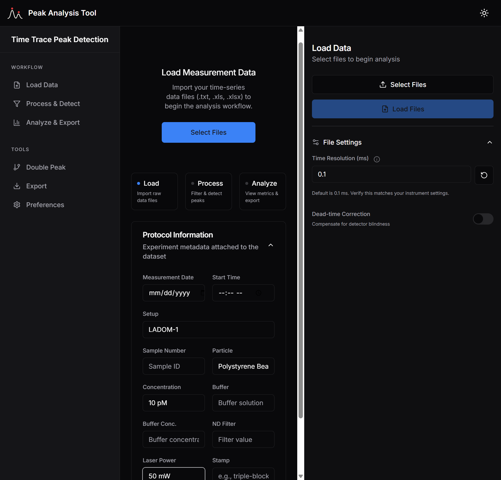
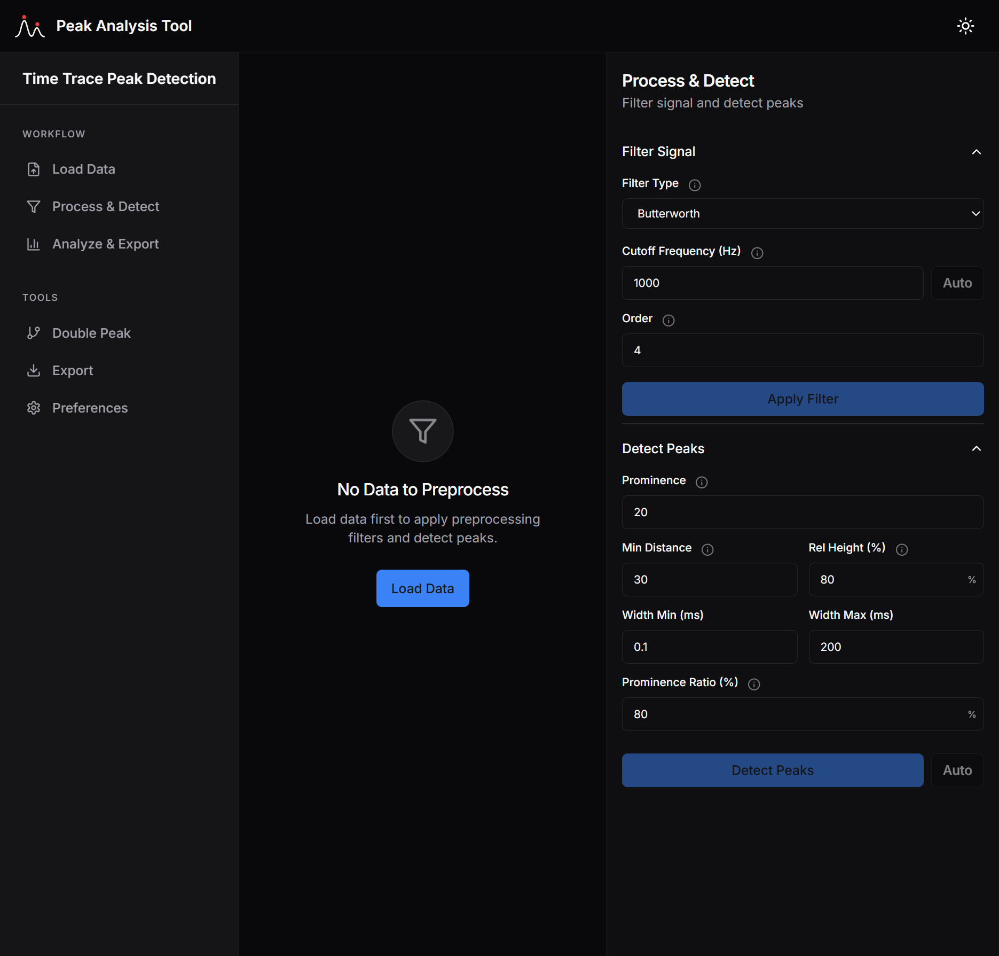
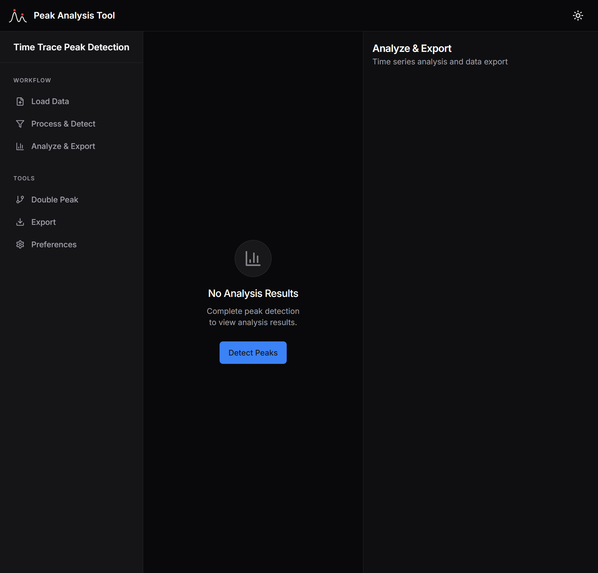
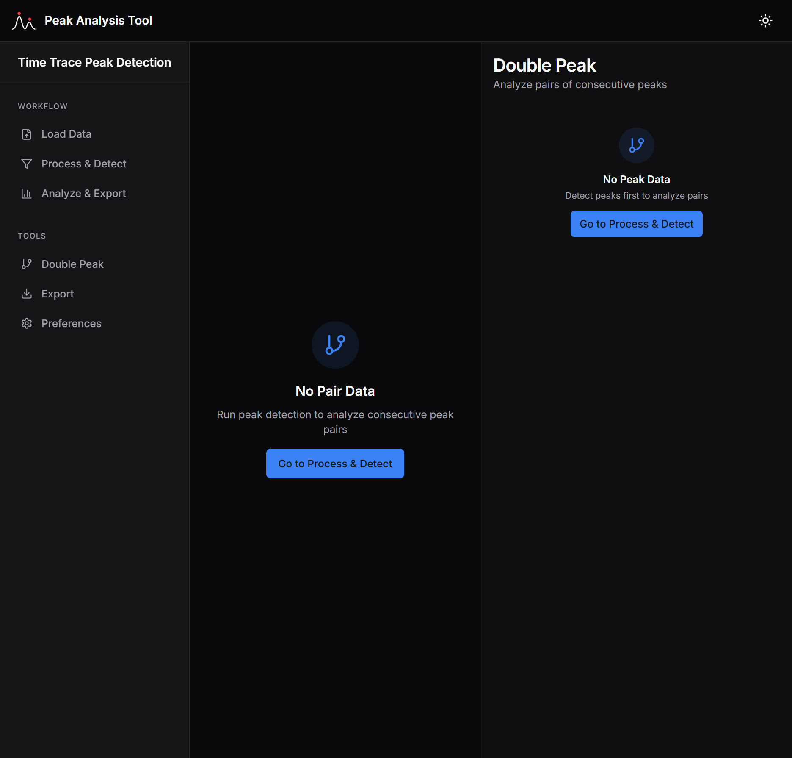

# User Interface & Workflow

This guide walks you through the main user interface of the Peak Analysis Tool, explaining the workflow from data loading to export.

## 1. Load Data
**Route:** `/load`

The entry point of the application. Here you can import time-series data files and define experimental metadata.

**Key Features:**
- **File Selection:** Supports `.txt`, `.xls`, `.xlsx` formats.
- **File Settings:**
  - **Time Resolution:** Default is 0.1 ms. Ensure this matches your instrument's sampling rate.
  - **Dead-time Correction:** Toggle this to enable physics-based correction for detector saturation (see [Mathematical Reference](mathematical_reference.md#31-dead-time-correction)).
- **Protocol Information:** Expandable section to log experiment details (Setup, Particle type, Concentration, etc.). These are preserved in the final export.

## 2. Process & Detect
**Route:** `/preprocess`

This view handles signal conditioning and peak detection parameters.

**Settings:**
- **Filter Signal:**
  - **Type:** Choose between `Butterworth` (Low-pass) or `Savitzky-Golay` (Smoothing).
  - **Cutoff Frequency:** For Butterworth, set the -3dB point. The "Auto" button estimates this based on peak widths.
- **Detect Peaks:**
  - **Prominence:** Minimum height of a peak relative to the local baseline.
  - **Distance:** Minimum separation between peaks (samples).
  - **Width Constraints:** Filter peaks by minimum/maximum width (ms).
  - **Prominence Ratio:** Filters out sub-peaks (noise on top of peaks). Higher values (>0.8) are stricter.

## 3. Analyze & Export
**Route:** `/analyze`

After detection, this view presents the results.

**Features:**
- **Interactive Chart:** Zoom and pan through the signal. Detected peaks are marked.
- **Metrics:**
  - Peak Count
  - Average Height/Width
  - Calculated Areas (Trapezoidal integration)
- **Export:** Download the results as a CSV file containing all peak properties and protocol metadata.

## 4. Double Peak Analysis
**Route:** `/double`

Specialized tool for analyzing pairs of consecutive peaks, useful for studying particle doublets or specific aggregation events.

**Visualization:**
- **Scatter Plot:** Correlates the properties of the first peak vs the second peak in a pair (e.g., Height 1 vs Height 2).
- **Interval Distribution:** Histogram of time delays between consecutive peaks.

