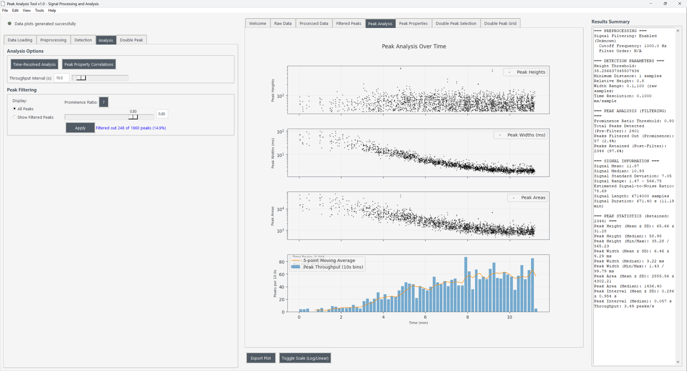
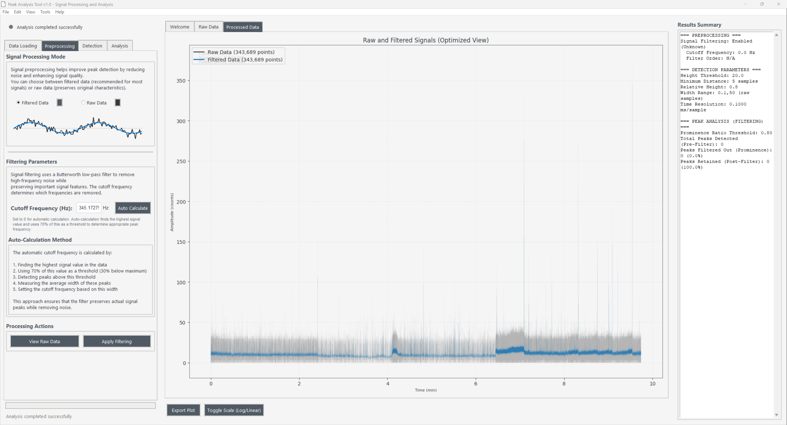
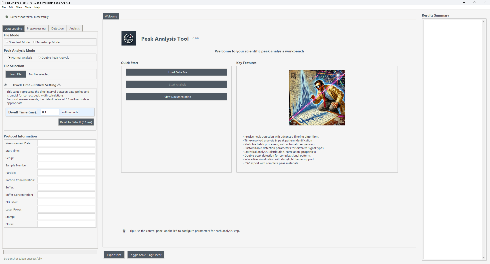
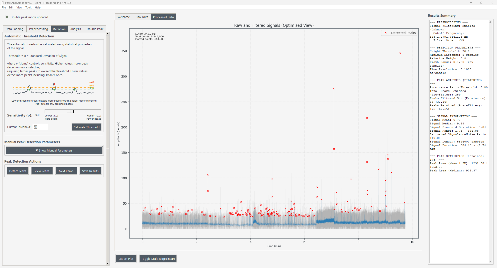
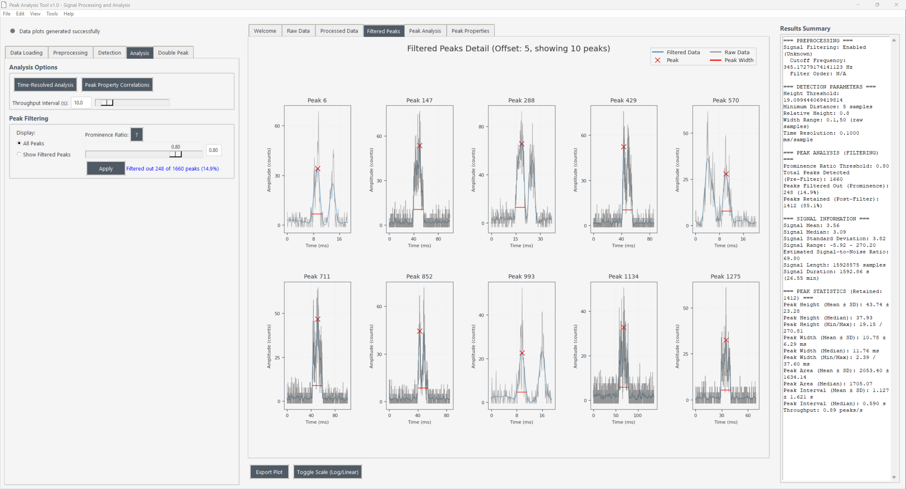
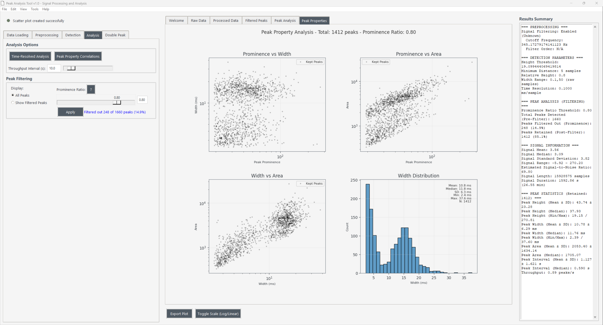
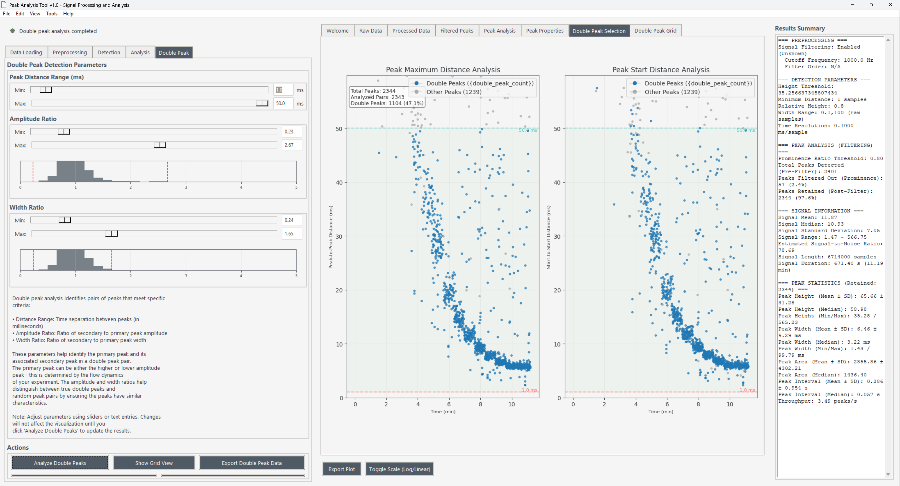

# Introduction {#sec:intro}

## Overview

The **Peak Analysis Tool** is a sophisticated Python-based application designed for detecting, analyzing, and characterizing transient peaks in time-series data. Built with a modern Tkinter GUI and powered by NumPy/SciPy computational libraries, it provides researchers with a comprehensive workbench for signal processing and peak analysis.

### Key Applications

- **Single-molecule fluorescence spectroscopy**: Detecting photon bursts from individual molecules
- **Nanopore sensing**: Analyzing ionic current spikes during molecular translocation
- **Chromatography**: Automated peak picking and quantification
- **General signal processing**: Any time-series data with transient events

### Core Capabilities

1. **High-throughput batch processing**: Analyze thousands of traces per hour
2. **Real-time visualization**: Interactive plots with immediate feedback
3. **Advanced filtering**: Butterworth and Savitzky-Golay filters with adaptive parameters
4. **Robust peak detection**: Enhanced scipy.signal.find_peaks with prominence-based filtering
5. **Comprehensive statistics**: Peak height, width, area, and interval distributions
6. **Export functionality**: CSV data and publication-ready plots

{#fig:main-interface width=90%}

---

# Installation and Setup {#sec:install}

## System Requirements

### Minimum Requirements
- **Operating System**: Windows 10/11, macOS 13+, or Linux (Ubuntu 20.04+)
- **Python**: Version 3.9 or higher
- **RAM**: 4 GB minimum (8 GB recommended for large datasets)
- **Storage**: 500 MB for application and dependencies

### Python Dependencies

The application requires the following Python packages:

```bash
numpy>=1.21.0          # Numerical computations
scipy>=1.7.0           # Signal processing algorithms
pandas>=1.3.0          # Data manipulation
matplotlib>=3.4.0      # Plotting and visualization
seaborn>=0.11.0        # Statistical visualizations
tkinter                # GUI framework (usually included with Python)
Pillow>=8.0.0         # Image processing
numba>=0.54.0         # JIT compilation for performance
psutil>=5.8.0         # System monitoring
```

## Installation Methods

### Method 1: Using pip (Recommended)

```bash
# Clone the repository
git clone https://github.com/yourusername/peak-analysis-tool.git
cd peak-analysis-tool

# Install dependencies
pip install -r requirements.txt

# Run the application
python main.py
```

### Method 2: Using the Standalone Executable

For users without Python installed, a pre-compiled executable is available:

1. Download the latest release from the GitHub releases page
2. Extract the ZIP file to your desired location
3. Double-click `PeakAnalysisTool.exe` to launch

### Method 3: Development Installation

For developers who want to contribute:

```bash
# Clone with development branch
git clone -b develop https://github.com/yourusername/peak-analysis-tool.git
cd peak-analysis-tool

# Create virtual environment
python -m venv venv
source venv/bin/activate  # On Windows: venv\Scripts\activate

# Install in development mode
pip install -e .
pip install -r requirements-dev.txt
```

---

# Quick Start Guide {#sec:quickstart}

## Basic Workflow

Here's a step-by-step guide to analyze your first dataset:

### Step 1: Launch the Application

```bash
python main.py
```

The application opens with a dark theme by default. You can switch to light theme via **View → Toggle Theme**.

### Step 2: Load Data

1. Click **File → Open** or press `Ctrl+O`
2. Select your data file (`.txt` or `.csv` format)
3. The file path appears in the control panel

### Step 3: Configure Parameters

Set initial analysis parameters in the control panel:

- **Height Threshold**: Start with 20 (adjust based on your signal amplitude)
- **Min. Distance**: 5 samples (prevents detecting noise as peaks)
- **Width Range**: "0.1,50" ms (filters peaks by duration)
- **Time Resolution**: 0.0001 s (100 μs per sample)

### Step 4: Run Analysis

1. Click **Analyze** to process the data
2. The raw data plot appears in the main visualization area
3. Status indicator shows processing progress

### Step 5: Detect Peaks

1. Click **Detect Peaks** to find peaks in the filtered signal
2. Detected peaks appear as red 'x' markers on the plot
3. Results summary updates with peak statistics

### Step 6: Review Results

- Use the tabbed interface to switch between different visualizations
- Check the Results Summary panel for statistics
- Navigate through individual peaks with **View Individual Peaks**

### Step 7: Export Results

- **File → Export Plot**: Save the current visualization
- **File → Export Data → Peak Information**: Save peak data as CSV

---

# Understanding the Interface {#sec:interface}

## Main Window Layout

The application window is divided into three main sections:

### 1. Control Panel (Left Side)

The control panel contains all parameter inputs and action buttons:

#### File Operations Section
- **File Path**: Displays loaded file(s)
- **File Mode**: Toggle between Standard and Batch processing
- **Start Time**: For trimming data (format: MM:SS)

#### Peak Detection Parameters
- **Height Threshold**: Minimum peak prominence (in signal units)
- **Min. Distance**: Minimum samples between peaks
- **Relative Height**: Fraction of peak height for width measurement (0-1)
- **Width Range**: Acceptable peak widths in milliseconds (min,max)
- **Prominence Ratio**: Filter for subpeak removal (0.1-1.0)

#### Signal Processing Parameters
- **Time Resolution**: Seconds per sample (affects all time calculations)
- **Filter Enabled**: Toggle Butterworth low-pass filter
- **Filter Type**: Choose between Butterworth and Savitzky-Golay
- **Cutoff Frequency**: Low-pass filter cutoff in Hz

#### Action Buttons
- **Analyze**: Process raw data and apply filters
- **Detect Peaks**: Find peaks in the filtered signal
- **View Individual Peaks**: Show detailed peak views
- **Auto Threshold**: Calculate threshold automatically
- **Auto Cutoff**: Determine optimal filter frequency

### 2. Visualization Area (Center)

The central area uses a tabbed interface for different plot types:

- **Raw Data**: Original signal as loaded from file
- **Filtered Signal**: Signal after preprocessing
- **Peak Analysis**: Filtered signal with detected peaks marked
- **Scatter Plots**: Peak property correlations
- **Histograms**: Distributions of peak parameters
- **Individual Peaks**: Grid view of selected peaks

### 3. Results Summary (Right Side)

A scrollable text area displaying:
- Number of detected peaks
- Statistical summaries (mean ± std)
- Peak filtering information
- Analysis parameters used

## Menu Bar Functions

### File Menu
| Command | Shortcut | Description |
|---------|----------|-------------|
| Open | Ctrl+O | Load data file(s) |
| Export Plot | Ctrl+E | Save current visualization |
| Export Data | - | Submenu for data export options |
| Exit | Ctrl+Q | Close the application |

### View Menu
- **Toggle Theme**: Switch between dark and light themes
- **Toggle Scale**: Switch between linear and logarithmic Y-axis

### Tools Menu
- **Auto Threshold**: Calculate detection threshold from noise statistics
- **Auto Cutoff**: Determine filter frequency from signal characteristics
- **Analyze Time-Resolved**: Throughput analysis over time windows

### Help Menu
- **Documentation**: Open this user manual
- **Keyboard Shortcuts**: Display shortcut reference
- **About**: Version and developer information

---

# Data Formats and Requirements {#sec:data}

## Supported File Formats

### Plain Text Files (.txt)

The application supports two column formats:

**Format 1: Time and Signal**
```
0.0000    1234.5
0.0001    1235.2
0.0002    1233.8
...
```

**Format 2: Signal Only**
```
1234.5
1235.2
1233.8
...
```

When using signal-only format, time values are generated based on the Time Resolution parameter.

### CSV Files (.csv)

Standard comma-separated format with optional headers:

```csv
Time,Signal
0.0000,1234.5
0.0001,1235.2
0.0002,1233.8
```

### Batch Processing Format

For timestamp mode, files should contain:
- Column 1: Timestamps in MM:SS format
- Column 2: Signal values

```
00:00    1234.5
00:01    1235.2
00:02    1233.8
```

## Data Quality Requirements

For optimal results, your data should meet these criteria:

| Parameter | Recommended Value | Rationale |
|-----------|-------------------|-----------|
| Sampling Rate | ≥ 10 kHz | Capture fast transients |
| Signal Length | ≥ 1000 points | Statistical reliability |
| SNR | > 3 | Distinguish peaks from noise |
| Dynamic Range | ≥ 12 bits | Avoid quantization artifacts |
| Baseline Stability | < 10% drift | Accurate peak detection |

---

# Signal Processing Pipeline {#sec:processing}

## Overview

The signal processing pipeline consists of several stages:

```
Raw Data → Filtering → Peak Detection → Property Calculation → Statistical Analysis
```

## Stage 1: Data Loading and Preprocessing

### Time Resolution Handling

The time resolution parameter (default: 0.0001 s = 100 μs) determines:
- Conversion between samples and time units
- Peak width calculations
- Frequency domain operations

### Data Validation

Upon loading, the application:
1. Checks for valid numeric data
2. Removes any header rows
3. Handles different decimal separators
4. Validates time monotonicity (if provided)

## Stage 2: Signal Filtering

### Butterworth Low-Pass Filter

The Butterworth filter provides a maximally flat frequency response in the passband:

**Transfer Function:**
$$H(s) = \frac{1}{\sqrt{1 + \left(\frac{f}{f_c}\right)^{2n}}}$$

Where:
- $f$ = frequency
- $f_c$ = cutoff frequency
- $n$ = filter order (default: 2)

**Implementation Details:**
- Uses `scipy.signal.butter` for coefficient calculation
- Applies zero-phase filtering with `filtfilt` to avoid time shifts
- Adaptive cutoff frequency based on peak characteristics

### Savitzky-Golay Filter

An alternative filtering method that fits successive sub-sets of adjacent data points with a low-degree polynomial:

**Mathematical Basis:**
The filter performs a least-squares fit of a polynomial of degree $p$ over a window of $2m+1$ points:

$$y_j = \sum_{i=-m}^{m} c_i \cdot x_{j+i}$$

**Parameters:**
- Window length: Automatically estimated from signal characteristics
- Polynomial order: 2 or 3 (preserves peak shapes)

### Automatic Cutoff Frequency Calculation

The auto-cutoff algorithm:

1. Finds the maximum signal value
2. Sets threshold at 70% of maximum
3. Detects peaks above this threshold
4. Measures average peak width
5. Sets cutoff frequency as: $f_c = \frac{1}{2 \cdot \text{avg\_width}}$

This ensures the filter preserves peak characteristics while removing high-frequency noise.

{#fig:preprocessing width=80%}

---

# Peak Detection Algorithm {#sec:detection}

## Core Algorithm

The peak detection uses an enhanced version of `scipy.signal.find_peaks` with additional filtering stages:

### Stage 1: Initial Peak Finding

Peaks are identified as local maxima that satisfy:

1. **Height criterion**: Peak prominence > threshold
2. **Distance criterion**: Separation > minimum distance
3. **Width criterion**: Peak width within specified range

### Stage 2: Peak Property Calculation

For each detected peak, the algorithm calculates:

#### Prominence
The height of a peak relative to the lowest contour line:

$$\text{Prominence} = h_{peak} - \max(h_{left}, h_{right})$$

Where $h_{left}$ and $h_{right}$ are the heights of the lowest points between the peak and its neighbors.

#### Width at Half Maximum (FWHM)
Measured at a specified relative height (default: 0.5):

$$\text{FWHM} = x_{right} - x_{left}$$

Where $x_{left}$ and $x_{right}$ are interpolated positions where the signal crosses the half-maximum level.

#### Peak Area
Calculated using trapezoidal integration:

$$\text{Area} = \int_{x_{left}}^{x_{right}} (y - y_{baseline}) \, dx \approx \sum_{i} \frac{(y_i + y_{i+1}) - 2y_{baseline}}{2} \Delta x$$

### Stage 3: Subpeak Filtering

The prominence ratio filter removes peaks sitting on larger peaks:

$$\text{Prominence Ratio} = \frac{\text{Prominence}}{\text{Peak Height}}$$

Peaks with ratio below the threshold (default: 0.8) are filtered out.

{#fig:detection-workflow width=90%}

## Parameter Guidelines

### Height Threshold

The threshold can be set manually or calculated automatically:

**Automatic Calculation:**
$$\text{Threshold} = \mu + n\sigma$$

Where:
- $\mu$ = mean signal value
- $\sigma$ = standard deviation
- $n$ = sigma multiplier (adjustable 1-10)

**Recommended Values:**
- Low noise: 3σ
- Moderate noise: 5σ (default)
- High noise: 7-10σ

### Minimum Distance

Prevents detection of noise fluctuations as separate peaks:

| Signal Type | Recommended Distance |
|-------------|---------------------|
| Sharp peaks | 3-5 samples |
| Broad peaks | 10-20 samples |
| Noisy data | 20-50 samples |

### Width Range

Filters peaks by duration:

- **Lower bound**: Removes noise spikes (typically 0.1-0.5 ms)
- **Upper bound**: Removes baseline drift (typically 20-50 ms)

### Prominence Ratio

Controls subpeak filtering:

- **0.9**: Very strict, only isolated peaks
- **0.8**: Default, good balance
- **0.5**: Permissive, allows overlapping peaks
- **0.1**: Minimal filtering

{#fig:detection-example width=80%}

---

# Peak Analysis Features {#sec:analysis}

## Individual Peak Visualization

The "View Individual Peaks" feature displays detailed views of detected peaks:

- **Grid Layout**: 10 peaks shown simultaneously (2×5 grid)
- **Navigation**: Use "Next Peaks" to cycle through all detected peaks
- **Display Elements**:
  - Filtered signal (orange)
  - Raw signal (blue)
  - Peak marker (red ×)
  - Width indicators (green lines)

{#fig:individual-peaks width=90%}

## Statistical Analysis

### Peak Property Distributions

The application calculates and displays:

1. **Height Distribution**: Histogram of peak prominences
2. **Width Distribution**: Histogram of FWHM values
3. **Area Distribution**: Histogram of integrated peak areas
4. **Interval Distribution**: Time between consecutive peaks

### Correlation Analysis

Scatter plots reveal relationships between peak properties:

- Height vs. Width: Identifies peak shape consistency
- Area vs. Height: Validates integration accuracy
- Width vs. Interval: Detects temporal patterns

{#fig:correlations width=80%}

## Double Peak Analysis

For analyzing paired events (e.g., entry/exit in nanopores):

### Detection Criteria

Double peaks are identified when:
1. Time separation: `min_distance` < Δt < `max_distance`
2. Amplitude ratio: `min_ratio` < A₂/A₁ < `max_ratio`
3. Width ratio: Within specified bounds

### Visualization Options

- **Grid View**: Individual double peak pairs
- **Scatter Plot**: Statistical relationships
- **Time Series**: Temporal distribution

{#fig:double-peaks width=80%}

---

# Advanced Features {#sec:advanced}

## Time-Resolved Analysis

Analyze how peak properties change over time:

1. Set the **Throughput Interval** (default: 10 seconds)
2. Click **Tools → Analyze Time-Resolved**
3. View results showing:
   - Peak rate vs. time
   - Average properties per interval
   - Temporal trends

## Batch Processing

Process multiple files automatically:

1. Set **File Mode** to "Batch"
2. Select multiple files with Shift+Click
3. Configure analysis parameters
4. Results are concatenated with file identifiers

## Protocol Information

Add experimental metadata to your analysis:

- **Sample ID**: Unique identifier
- **Buffer Conditions**: Solution composition
- **Measurement Date**: Timestamp
- **Experimental Notes**: Free-text annotations

This information is included in exported CSV files for traceability.

---

# Exporting Results {#sec:export}

## Plot Export

Save visualizations in publication-ready formats:

### Supported Formats
- **PNG**: High-resolution raster (300 DPI)
- **PDF**: Vector format for publications
- **SVG**: Editable vector format
- **EPS**: For LaTeX documents

### Export Options
1. Current plot: **File → Export Plot** (Ctrl+E)
2. All plots: Export each tab separately
3. Custom DPI: Adjust in settings

## Data Export

### Peak Information CSV

Comprehensive peak data including:

```csv
Peak Index,Time (s),Height,Width (ms),Area,Interval,Sample ID,Date
0,0.123,45.2,1.23,55.6,0.123,Sample_001,2024-01-06
1,0.456,38.7,1.45,48.2,0.333,Sample_001,2024-01-06
```

### Raw Data Export

Original or filtered signal data:

```csv
Time (s),Signal,Filtered Signal
0.0000,1234.5,1234.2
0.0001,1235.2,1234.8
```

### Double Peak Export

Paired peak analysis results:

```csv
Peak1 Index,Peak2 Index,Time Diff (ms),Amp Ratio,Width Ratio
5,6,2.34,0.87,1.12
15,16,2.45,0.92,1.08
```

---

# Troubleshooting {#sec:troubleshooting}

## Common Issues and Solutions

### No Peaks Detected

**Symptoms**: "No peaks found" message after detection

**Solutions**:
1. Lower the height threshold
2. Reduce minimum distance
3. Widen the width range
4. Check if filter is removing real peaks
5. Verify time resolution is correct

### Too Many Peaks Detected

**Symptoms**: Noise detected as peaks

**Solutions**:
1. Increase height threshold
2. Use Auto Threshold with higher sigma
3. Increase minimum distance
4. Enable and adjust filtering
5. Narrow the width range

### Memory Errors with Large Files

**Symptoms**: Application crashes or freezes

**Solutions**:
1. Process files in smaller batches
2. Increase decimation for plotting
3. Close other applications
4. Use 64-bit Python installation

### Export Issues

**Problem**: Exported plots are blank or corrupted

**Solutions**:
1. Ensure plot is fully rendered before export
2. Try different file format
3. Check file permissions
4. Update matplotlib

---

# Performance Optimization {#sec:performance}

## Tips for Large Datasets

### Memory Management
- The application uses memory mapping for files > 100 MB
- Decimation automatically applied for plotting (max 10,000 points)
- Original data preserved for analysis accuracy

### Processing Speed
- Numba JIT compilation accelerates critical functions
- Parallel processing for batch mode
- Efficient numpy operations throughout

### Recommended Practices
1. **Pre-filter data** if possible to reduce file size
2. **Use appropriate time resolution** to avoid oversampling
3. **Process in batches** for very long recordings
4. **Close unnecessary tabs** to free memory

---

# Mathematical Background {#sec:math}

## Signal Processing Theory

### Nyquist-Shannon Sampling Theorem

For accurate peak detection:
$$f_s > 2 \cdot f_{max}$$

Where $f_s$ is sampling frequency and $f_{max}$ is the highest frequency component.

### Digital Filter Design

The Butterworth filter order affects the transition band:

$$\text{Attenuation (dB)} = 20n \log_{10}\left(\frac{f}{f_c}\right)$$

Where $n$ is the filter order.

### Peak Detection Mathematics

#### Local Maximum Condition
A point $x_i$ is a peak if:
$$x_i > x_{i-1} \text{ and } x_i > x_{i+1}$$

#### Prominence Calculation
Uses contour line algorithm:
1. Find key col (lowest point) to the left: $c_L$
2. Find key col to the right: $c_R$
3. Prominence = $x_i - \max(c_L, c_R)$

---

# Keyboard Shortcuts {#sec:shortcuts}

## Implemented Shortcuts

| Shortcut | Action |
|----------|--------|
| Ctrl+O | Open file |
| Ctrl+E | Export plot |
| Ctrl+Q | Quit application |

## Standard Navigation

The application uses standard Windows/GUI navigation:
- **Tab**: Move to next control
- **Shift+Tab**: Move to previous control
- **Mouse click**: Direct selection of controls and tabs

---

# Glossary {#sec:glossary}

**Prominence**
: The height of a peak relative to the higher of its two neighboring valleys

**FWHM (Full Width at Half Maximum)**
: The width of a peak measured at 50% of its maximum height

**Butterworth Filter**
: A type of signal processing filter designed to have a frequency response as flat as possible in the passband

**Savitzky-Golay Filter**
: A digital filter that applies a local polynomial regression on a series of equally spaced data points

**Time Resolution**
: The time interval between consecutive data points in the signal

**Prominence Ratio**
: The ratio of peak prominence to peak height, used to identify subpeaks

**Decimation**
: The process of reducing the sampling rate of a signal for visualization purposes

---

# References {#sec:references}

1. Virtanen, P. et al. (2020). SciPy 1.0: fundamental algorithms for scientific computing in Python. Nature Methods, 17(3), 261-272.

2. Harris, C. R. et al. (2020). Array programming with NumPy. Nature, 585(7825), 357-362.

3. Hunter, J. D. (2007). Matplotlib: A 2D graphics environment. Computing in Science & Engineering, 9(3), 90-95.

4. Savitzky, A., & Golay, M. J. (1964). Smoothing and differentiation of data by simplified least squares procedures. Analytical Chemistry, 36(8), 1627-1639.

5. Butterworth, S. (1930). On the theory of filter amplifiers. Experimental Wireless and the Wireless Engineer, 7, 536-541.

---

---

## Build Information

**Version**: 1.2.0  
**Build Date**: January 2025  
**Documentation Format**: Pandoc Markdown  

### Building PDF Documentation

```bash
pandoc user_manual.md -o user_manual.pdf \
  --pdf-engine=xelatex \
  --toc --number-sections \
  --filter pandoc-crossref \
  -V geometry:margin=25mm \
  -V colorlinks \
  -V mainfont="TeX Gyre Pagella"
```

---
